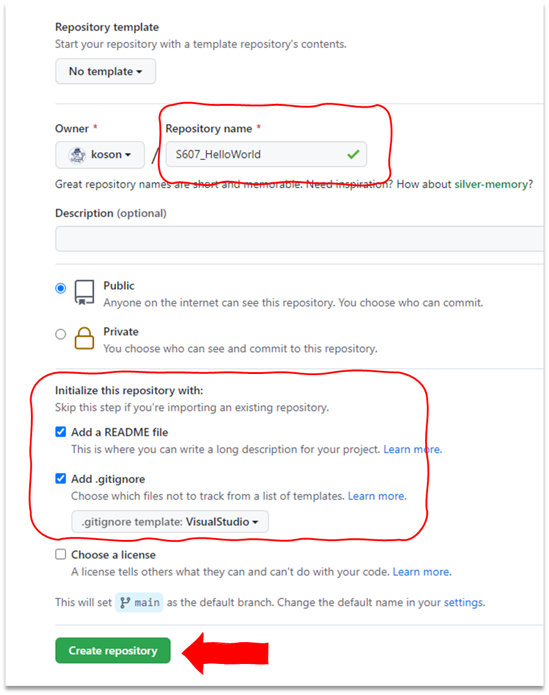
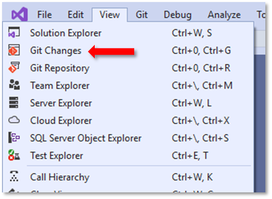
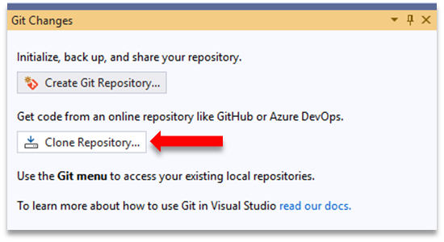
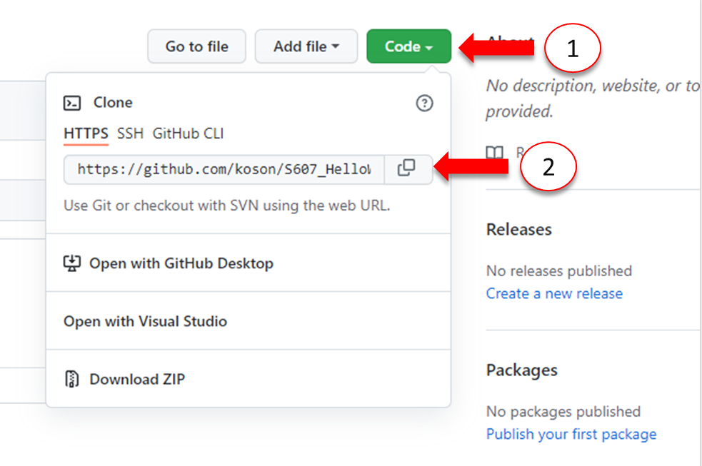
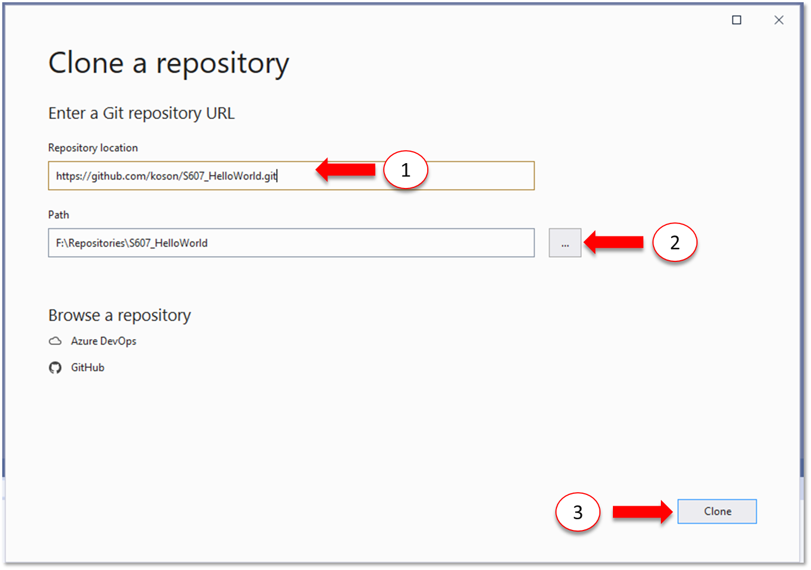
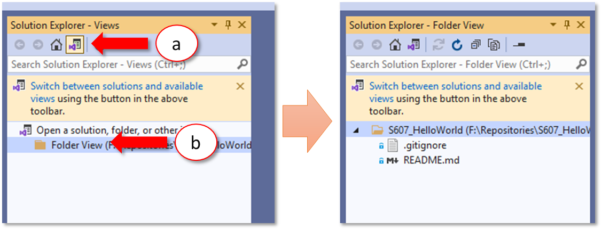
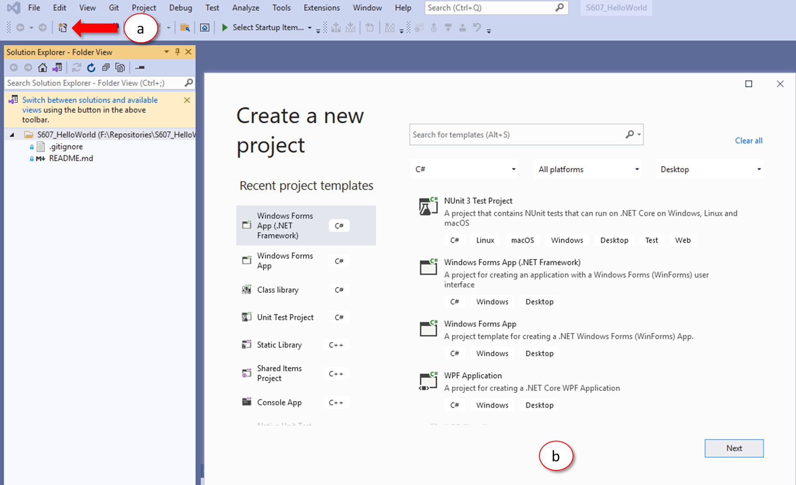

# การทดลองสัปดาห์ที่ 11  #
# การใช้งาน git ร่วมกับ Visual studio IDE #
---
## 11.2 การ clone จาก repository ด้วย Visual Studio ##

9. สร้าง repository บน GitHub.com โดยมีรายละเอียดดังนี้
    <ul>
      <li> Repository name : Sxxx_HelloWorld <i>[โดย xxx คือเลขสามตัวท้ายของรหัสนักศึกษา]</i>
      <li> [X] Initialize this repository with a README
      <li> [ Add .gitignore : VisualStudio] 
    </ul>



#### ให้ capture หน้าจอ repo ที่ได้ของนักศึกษามาแทนที่ภาพนี้ ####

```
ผลการสร้าง repo บน github.com
```


<table>
<tr> 
<td valign="top" width = "50%">10. ใน Visual Studio ให้ไปที่หน้าต่าง Git Changes 
 </td>
<td valign="top"> </p> </td>

</tr>
<td valign="top" width = "50%">11. คลิกที่ Clone Repository...</td>
<td valign="top"> </p> </td>

</table>


<table>

<tr> 
<td valign="top" width = "40%">12.  ในหน้าต่าง Clone a GitHub Repository  Clone <br>
 12.1 ไปที่ GitHub Repository เพื่อคัดลอก url ของ repository ชื่อ HelloWorld ที่ได้สร้างไว้ในขั้นตอนที่ 8 แล้วกดปุ่ม Code และตัดลอก url</td>
<td valign="top"> </p> </td>
</tr>

<tr> 
<td valign="top" width = "40%">12.2 วาง url ของ repository ลงใน (1) <br> เลือก folder ที่ตั้งของ working directory ใน (2)  แล้วกดปุ่ม Clone (3) </td>
<td valign="top"> </p> </td>
</tr>


</table>


<table>
<tr> 
<td valign="top" width = "50%">13. ไปที่ Solution Explorer  
<br> 13.1 คลิกที่ (a)  หรือ (b) เพื่อสวิตช์ระหว่าง Views และ Folder View </td>
<td valign="top"> </p> </td>
</tr>
</table>


<table>
<tr> 
<td valign="top" width = "50%">14. ถึงตรงนี้ จะเห็นว่ามีการ clone repository มาแล้ว แต่ยังไม่มี project ใดๆ ให้สร้าง project ใหม่ ตามกระบวนการพัฒนา software ด้วย Visual Studio

<br>15. ให้ทำการสร้าง Solution พร้อมทั้ง Sync กับ Github ตามขั้นตอนที่ 4 - 8
</td>
<td valign="top"> </p> </td>

</table>


#### ++เมื่อ sync เสร็จ ให้ตรวจสอบรายการไฟล์ใน repository บน GitHub.com++

- capture หน้าจอของ  Visual Studio ใส่ไว้แทนภาพด้านล่างนี้ด้วย


